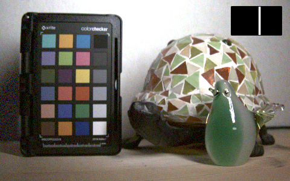

# Light Transport Matrix Acquisition [[Video]](https://youtu.be/ukuN_gJ85UQ)

## What is the Light Transport Matrix?

The **Light Transport Matrix** expresses the relationship between the light source (e.g., projector or display) and the camera in linear form. It can represent as follows:

*c = T p*

The column vector *p* is the projected pattern (pxq, 1). The column vector *c* is the image captured by the camera (mxn, 1). The matrix *T* is the light transport matrix (mxn, pxq).
Where p and q are the sizes of the projected pattern, and m and n are the sizes of the image captured by the camera.

The light transport matrix is used for **relighting** [Debevec et al., 2000] and **dual-photography** [Sen et al., 2005].

## Acquisition of the Light Transport Matrix
This project uses **multiplexed illumination** [Schechner et al., 2003] to acquire the light transport matrix. Multiple sources are illuminated in a single capture in the measurement, and the matrix is estimated after capturing images.
Here I use the **unstructured light pattern** [Couture et al., 2011] for projection. This method can be set to any spatial frequency to generate random patterns with multiple frequencies.

Suppose N images are taken (note: N must be greater than the number of light sources (N>=pxq)).
Stack the vectors *c* and *p* to create the matrices *cn* (mxn, N) and *pn* (pxq, N). The relation to the light transport matrix *T* (mxn, pxq) is as follows:

*cn = T pn*

If there is a pseudo-inverse *pn+* of matrix *pn*, then matrix *T* can be calculated as follows:

*T = cn pn+*

## Measurement Setup
Here is the setup for the measurement. A display (EIZO, FlexScan EV2451) is used as a light source. The original resolution of the display is 1920x1080, but I set it to 48x27 (i.e. p=48, q=27) to reduce the measurement time.
The image is taken with a color camera (FLIR, BFS-U3-23S3C-C) set to 480x300 (i.e. m=480, n=300).
In the scene, a color checker and glass objects are placed.

## Relighting Results
Here are the results of relighting using the light transport matrix.
| | |
| :---: | :---:|
|  | |
|  | |

## Try the Light Transport Matrix as You Like
This repository provides the measured data and programs. So you can do relighting too.

### Download the Measured Data
You can [download the measured data from here](https://drive.google.com/drive/folders/17oZg4I74cP7B--5BiqbDZqM0fObCukN0?usp=sharing). This data is set to 16x9 display resolution (i.e. p=16, q=9) to reduce the size.

### Usage

#### Requirements
- NumPy
- OpenCV
- scikit-image
- structuredlight (https://github.com/elerac/structuredlight)

#### Programs
- `01_calculate_light_transport.py`: Calculate the light transport matrix from measured data.
- `02_relighting.py`: Relighting with the light transport matrix.
- `03_visualize.py`: Visualize the distribution from light sources at specific camera pixel.

Screen shot of `03_visualize.py`.

## References
- [Light transport matrices (Computational Photography, CMU)](http://graphics.cs.cmu.edu/courses/15-463/2020_fall/lectures/lecture25.pdf)
- Debevec et al., "Acquiring the reflectance field of a human face."  SIGGRAPH 2000.
- Sen et al., "Dual photography." SIGGRAPH 2005.
- Schechner et al., "A theory of multiplexed illumination." ICCV 2003.
- Couture et al., "Unstructured light scanning to overcome interreflections." ICCV 2011.